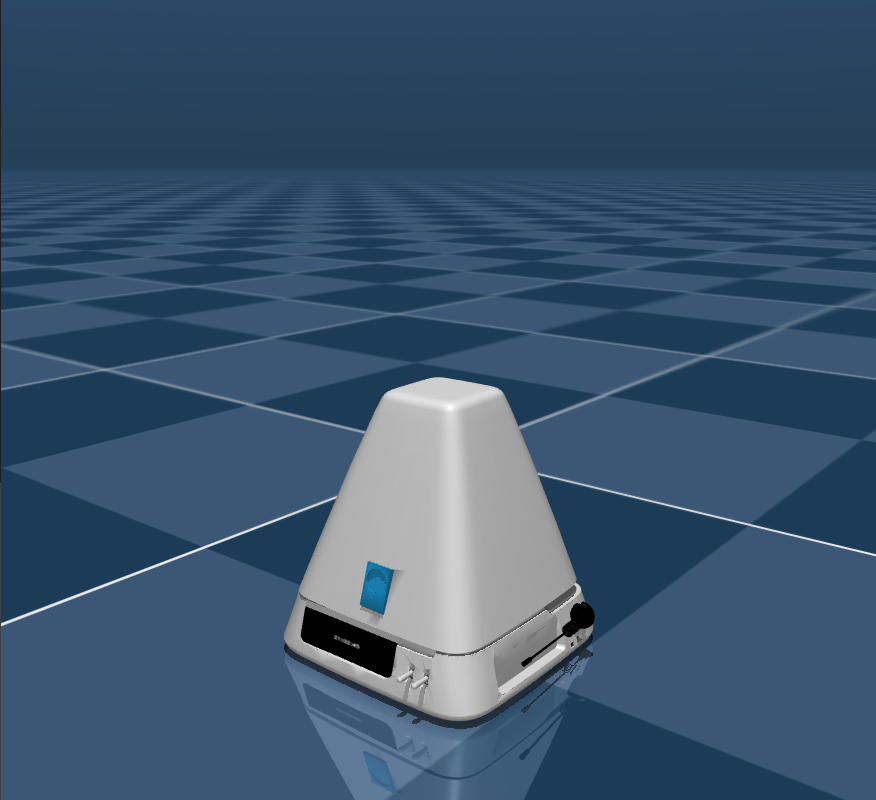
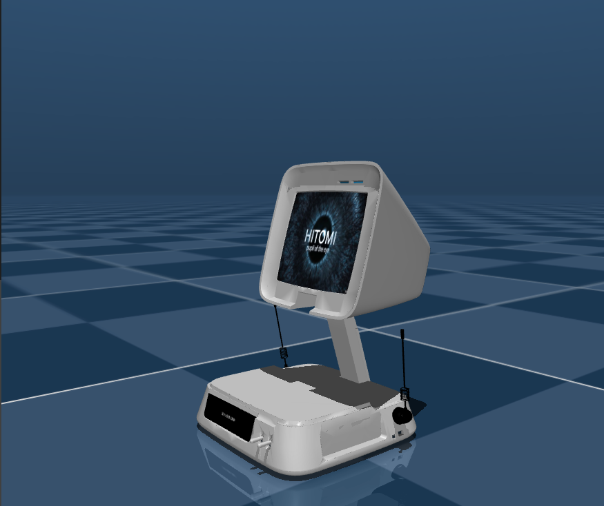
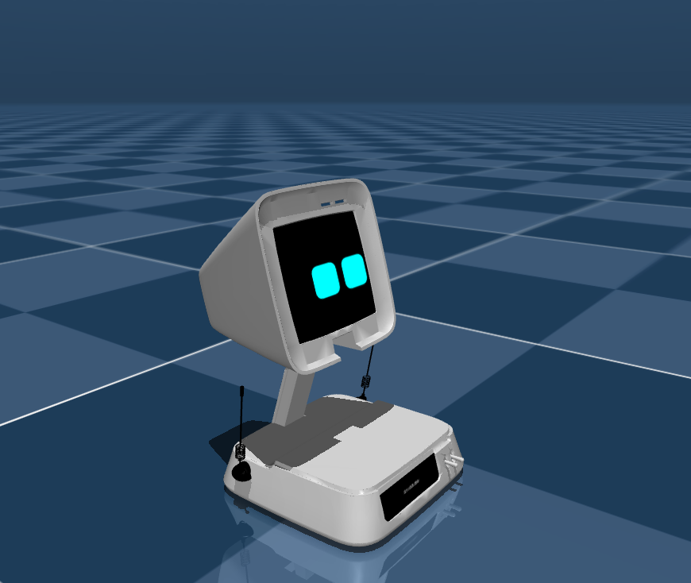

A simultation available 

# Companion desgin
# when closed

# boot_up

# running

# UI demo
<video src="./src/mind/assets/videos/ui_demo.mp4" width="640" controls> not supported</video>
---

# 🤖 Personalized Companion — HITOMI Architecture

> _Adaptive Interaction · Emotional Understanding · Causal Intelligence_

---

## 🧠 Overview

**HITOMI** is the orchestrator agent powering a **Personalized Companion** designed for adaptive interaction, emotional understanding, and causal reasoning.  
The architecture follows a **Ports & Adapters** (Hexagonal) model — ensuring modularity, transparency, and integration between perception, cognition, and action.

---

## 🧩 System Architecture

Above image is a base architecture. New sub-agents will be added.

### 🔸 Core Concept
The system is divided into **Ports** (interfaces for perception and action) and **Agents** (reasoning and monitoring units).  
HITOMI acts as the **main orchestrator**, coordinating multiple sub-agents to perceive, interpret, and respond intelligently to user states and environmental cues.

---

### 🧠 Components

#### **1. HITOMI (Orchestrator / Main Agent)**
- Central cognitive controller that manages reasoning and decision flow.  
- Interfaces directly with the **User**, orchestrating all sub-modules.  
- Maintains adaptive behavior through continuous feedback.

#### **2. Perception Port**
- Handles sensory input from the **Environment** and **User**.  
- Integrates computer vision, speech processing, and context inference.  
- Connects to:
  - **Memory** — for persistent state storage.  
  - **Tools** — for reasoning, planning, and API calls.

#### **3. Act Port**
- Executes high-level commands decided by HITOMI.  
- Manages actuators or simulated control via **ROS2** and **Gazebo**.  
- Provides feedback to both the environment and HITOMI.

#### **4. Sub-Agents**
| Module | Function |
|--------|-----------|
| 🧭 **User Intent Monitor** | Interprets user goals and conversational context. |
| 🎭 **User Emotions Monitor** | Analyzes emotional tone and adjusts responses. |
| ❤️ **Health Monitor** | Tracks user well-being and safety signals. |
| ⚙️ **Utilities Manager** | Manages reminders, scheduling, and background tasks. |

#### **5. Memory & Tools**
- **Memory:** Long-term storage of user data, context, and emotional states.  
- **Tools:** Interfaces for reasoning APIs, retrieval systems, and task automation.

---

## ⚙️ Tech Stack

**Languages:** Python, C++  
**Frameworks:**PyTorch, OpenCV, LangChain, LangGraph  
**Libraries:** SpeechRecognition, pyttsx3, Transformers  
**Tools:** VS Code, Jupyter, Git, Anaconda

---

## 🚀 Features

- 🗣️ Natural voice-to-voice interaction  
- 🎭 Emotion-aware dialogue  
- 🧠 Causal reasoning and adaptive response  
- 🧩 Modular architecture for easy extension  
- 🧪 Simulation-ready with ROS2 + Gazebo integration  

---

## 🧪 Research Direction

This system explores how **Cognitive Architectures** and **World Models** can be integrated into companion robots.  
HITOMI’s goal is not only to interact but to **understand** — modeling user intent, emotion, and environment through causal inference rather than statistical correlation.

