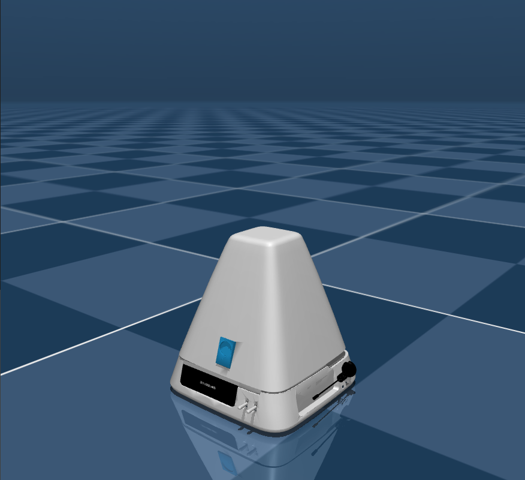
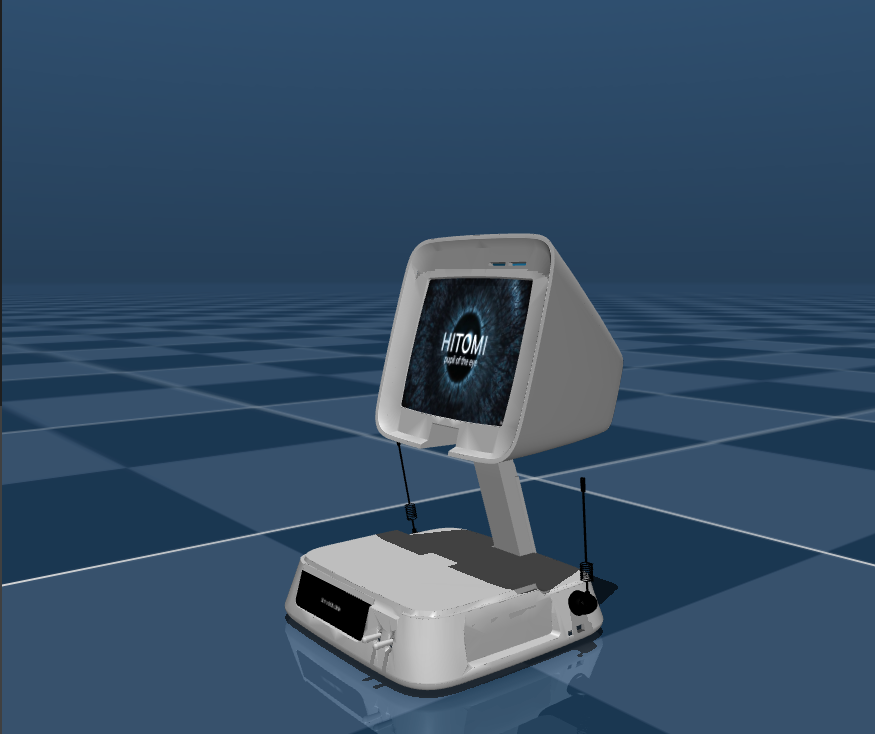
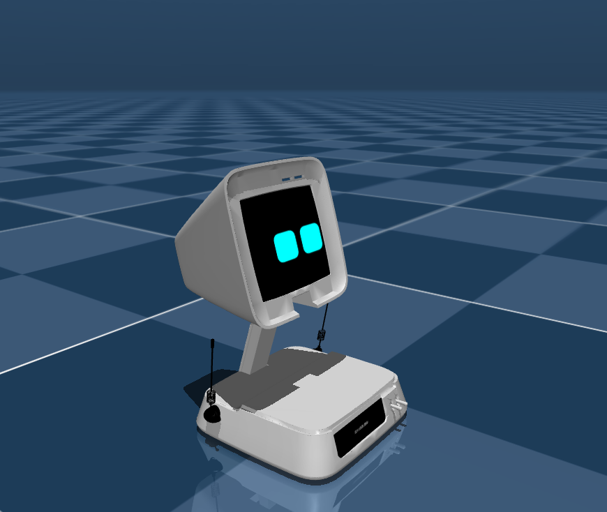
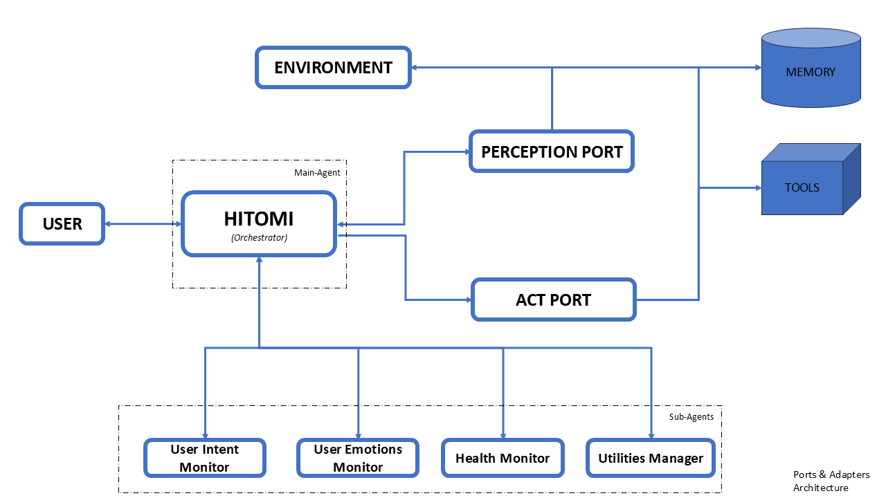

Mind is a framework designed with Hexagonal Architecture. I will complete this as a complete Cognitive Architecture.

Cognitive Architecture with Hierachical Agents.

I named the robot and the main orchestrator agent as HITOMI.

A simultation available for HITOMI

# Companion desgin
# when closed

# boot_up

# running

# UI demo

https://github.com/user-attachments/assets/f41330e6-103b-41e5-88b8-0171b026e4bf

---

# 🤖 Personalized Companion — Hitomi Architecture

> _Adaptive Interaction · Emotional Understanding · Causal Intelligence_

---

## 🧠 Overview

**HITOMI** is the orchestrator agent powering a **Personalized Companion** designed for adaptive interaction, emotional understanding, and causal reasoning.  
The architecture follows a **Ports & Adapters** (Hexagonal) model — ensuring modularity, transparency, and integration between perception, cognition, and action.

---

## 🧩 System Architecture

Above image is a base architecture. New sub-agents will be added.

### 🔸 Core Concept
The system is divided into **Ports** (interfaces for perception and action) and **Agents** (reasoning and monitoring units).  
HITOMI acts as the **main orchestrator**, coordinating multiple sub-agents to perceive, interpret, and respond intelligently to user states and environmental cues.
